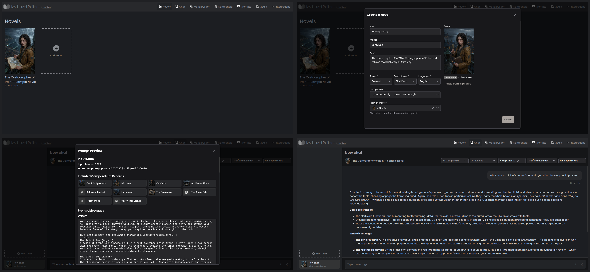
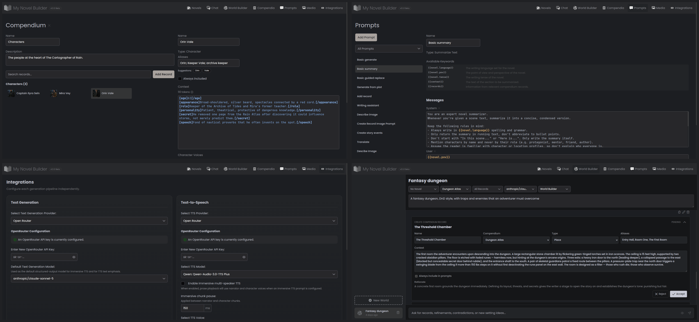

<p align="center">
  
</p>

<h1 align="center">MyNovelBuilder</h1>

<p align="center">
  A place to write a novel, keep its reference material close, and bring in AI when it is useful.
</p>

MyNovelBuilder is the writing program I wanted for myself. It keeps the
manuscript, story structure, notes, prompts, chats, and generated media in one
local workspace. There is no hosted service or bundled AI subscription. You
can write and organize a novel without an API key, then connect your own
providers or local servers for the optional AI features.

This is a beta passion project built around my own writing workflow. Keep
backups of work you care about. Suggestions are welcome, but feature requests
and pull requests will be evaluated against the direction of the project.

The frontend currently targets desktop-sized windows. It is not yet responsive
and will not look good on narrow screens. Responsive layouts are planned for a
later release.

## Download

[Download the latest release](https://github.com/davidetestoni/MyNovelBuilder/releases/latest)

Desktop packages are available for Windows, macOS, and Linux on x64 and arm64.
They are not code-signed, so your operating system may warn you before running
them. The releases page will remain empty until the first public release is
published.

See the [desktop installation guide](docs/desktop.md) for choosing the correct
package and handling unsigned-application warnings. Docker and source
installation instructions are available in the [documentation](docs/index.md).

## What it does

A manuscript is split into chapters and sections. You can write in the prose
editor, rearrange the book on a planning board, keep section summaries, and
track story events alongside the draft. Finished work can be exported as
Markdown, HTML, or PDF.

Reference material lives in reusable compendia. Characters, places, objects,
events, concepts, and other records can be attached to a novel and included in
AI requests when they are relevant. Record overrides let those details change
at a particular point in the story without rewriting the original record.

AI is optional and uses your own provider credentials. It can help draft or
revise prose, summarize sections, discuss the manuscript in a context-aware
chat, propose world-building records for review, generate images or video, and
read prose aloud. Prompts are visible and editable, and prompt previews show
what context will be sent before a request is made.

## Screenshots

[](docs/assets/screenshots/writing-and-ai.png)

*Writing and AI. Click the image to inspect it at full resolution.*

[](docs/assets/screenshots/worldbuilding-and-setup.png)

*Worldbuilding and setup. Click the image to inspect it at full resolution.*

## Documentation

Start with the [documentation hub](docs/index.md) to choose between Docker and
a source checkout. The [developer setup guide](docs/development.md) covers a
clean clone, isolated development data, tests, and production-style publishing.

## Run with Docker

From a directory containing `compose.yaml`:

```shell
docker compose up -d
```

Open <http://localhost:5113>. Your novels and settings are kept in a Docker
volume and survive container replacement and upgrades.

See the [Docker guide](docs/docker.md) for updates, local image builds,
persistent-data details, and connecting to TTS servers running on the host.

## Release history

See the [changelog](CHANGELOG.md) for user-visible changes. Maintainer-facing
versioning and release conventions are documented in the
[release guide](docs/releases.md).

## Repository tasks

The cross-platform task runner keeps local development and future CI on the
same commands:

```shell
node scripts/tasks.mjs restore
node scripts/tasks.mjs test
node scripts/tasks.mjs build
node scripts/tasks.mjs publish-web
node scripts/tasks.mjs dev
node scripts/tasks.mjs desktop-dev
node scripts/tasks.mjs package-desktop linux-x64
```

Run `node scripts/tasks.mjs --help` for details. `publish-web` creates the
complete ASP.NET Core and Angular application under `artifacts/publish/web`;
generated files in `artifacts` are ignored by Git. `desktop-dev` builds the
production SPA and opens it in Electron on the current x64 or arm64 machine;
close the window or press Ctrl+C to stop the desktop host. On Linux this local,
unpackaged command prints and uses `--no-sandbox` because its npm-installed
Chromium helper cannot be setuid root; release packages must remain sandboxed.

`package-desktop` accepts `win-x64`, `win-arm64`, `osx-x64`, `osx-arm64`,
`linux-x64`, or `linux-arm64`. Electron packages must be built on their target
operating system, although either architecture can be selected there. The
unsigned packages are written to `artifacts/desktop/packages/<rid>`.
On Ubuntu systems that restrict unprivileged user namespaces, prefer the DEB:
its installation configures Chromium's setuid sandbox. The portable AppImage
requires user namespaces on those systems; the application does not silently
disable its sandbox.

## License

MyNovelBuilder is released under the
[GNU General Public License v3.0 only](LICENSE). Third-party libraries and
assets remain subject to their own licenses.
